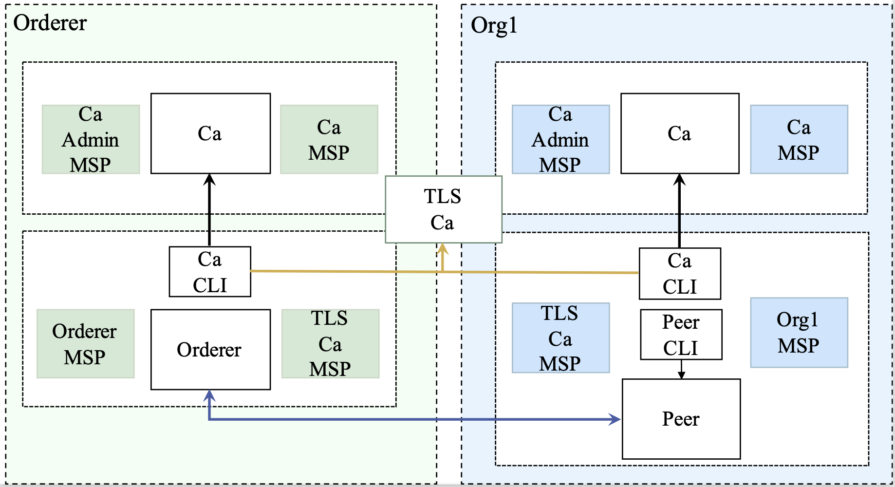
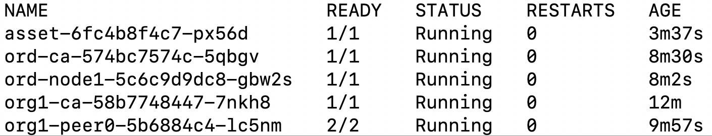

# A Cloudification Framework for Blockchain Based on Hyperledger Fabric

## What is ***Cloudification Framework***?

The goal of the framework is to manage Hyperledger Fabric(HF) more simply and natively under the cloud-native technology system.

## Getting started

### Requirement

- [KubeBuilder](https://book.kubebuilder.io/quick-start.html)
- [code-generate](https://github.com/kubernetes/code-generator/blob/master/generate-internal-groups.sh)

### Install StorageClass
```
helm install nfs-client stable/nfs-client-provisioner --set nfs.server=xxx --set nfs.path=xxx

# 测试
kc apply -f ./yaml/test-pvc.yaml
```

### Update the pkg
```bash
./hack/update-codegen.sh 
```

### Download Go mod
```
go env -w GOPROXY=https://goproxy.cn,direct
go env -w GO111MODULE=on
go mod tidy
go mod vendor
go env -w GO111MODULE=off
```

### Start manager
```
make install   # deploy the CRDs in k8s
make run 

go build -o hfoperator ./command/main.go
```

## Deploy a network
As shown in the figure, we will build the most classic and simple HF network. 
The test focuses on the whole process of HF(Ca, Peer, Orderer, Channel, Chaincode) to verify the function.



### Deploy a Peer Organization

```bash
# create ca
hfoperator ca create --name=org1-ca --enroll-id=enroll --enroll-pw=enrollpw

# deploy peer
hfoperator peer create --name=org1-peer0 --enroll-id=peer --enroll-pw=peerpw --db=CouchDB --ca-name=org1-ca --mspid=Org1MSP

```

### register user for the peer
```bash

# register user for the peer
hfoperator ca register --name=org1-ca --user=peer --user-pw=peerpw --type=peer --enroll-id=enroll --enroll-pw=enrollpw --mspid=Org1MSP

# enroll for the user
hfoperator ca enroll --name=org1-ca --user=admin --user-pw=adminpw --mspid=Org1MSP --ca-name=org1-ca  --output peer-org1.yaml
hfoperator inspect --output org1.yaml -o Org1MSP -o OrdererMSP
hfoperator utils adduser --userPath=peer-org1.yaml --config=org1.yaml --username=admin --mspid=Org1MSP

```

## Deploy a Orderer Organization

```bash
# create ca
hfoperator ca create --name=orderer-ca --enroll-id=enroll --enroll-pw=enrollpw

# deploy orderer
hfoperator orderer create --name=orderer --enroll-id=orderer --mspid=OrdererMSP --ca-name=orderer-ca --enroll-pw=ordererpw 

```

### register user for the peer
```bash
# register user for the orderer
hfoperator ca register --name=ord-ca --user=admin --user-pw=adminpw --type=admin --enroll-id=enroll --enroll-pw=enrollpw --mspid=OrdererMSP
hfoperator ca enroll --name=ord-ca --user=admin --user-pw=adminpw --mspid OrdererMSP --ca-name=orderer-ca

hfoperator inspect --output ordservice.yaml -o OrdererMSP
hfoperator utils adduser --userPath=admin-ordservice.yaml --config=ordservice.yaml --username=admin --mspid=OrdererMSP
```

## Create a channel
```bash
hfoperator channel generate --output=chan.block --name=chan --organizations Org1MSP --ordererOrganizations OrdererMSP
hfoperator ca enroll --name=ord-ca --user=admin --user-pw=adminpw --mspid=OrdererMSP --ca-name=tlsca  --output admin-tls-ordservice.yaml 
hfoperator orderer join --block=chan.block --name=ord-node1 --identity=admin-tls-ordservice.yaml
```

### Join channel
```bash
hfoperator channel join --name=chan --config=org1.yaml --user=admin -p=org1-peer0.default
```

### Inspect the channel
```bash
hfoperator channel inspect --channel=chan --config=org1.yaml --user=admin -p=org1-peer0.default > chan.json
hfoperator channel addanchorpeer --channel=chan --config=org1.yaml --user=admin --peer=org1-peer0 

```

## Install a chaincode

```bash
export CHAINCODE_NAME=asset
export CHAINCODE_LABEL=asset
cat << METADATA-EOF > "metadata.json"
{
    "type": "ccaas",
    "label": "${CHAINCODE_LABEL}"
}
METADATA-EOF

cat > "connection.json" <<CONN_EOF
{
  "address": "${CHAINCODE_NAME}:7052",
  "dial_timeout": "10s",
  "tls_required": false
}
CONN_EOF

tar cfz code.tar.gz connection.json
tar cfz asset-transfer-basic-external.tgz metadata.json code.tar.gz
export PACKAGE_ID=$(hfoperator chaincode calculatepackageid --path=asset-transfer-basic-external.tgz --language=node --label=$CHAINCODE_LABEL)
echo "PACKAGE_ID=$PACKAGE_ID"

hfoperator chaincode install --path=./asset-transfer-basic-external.tgz --config=org1.yaml --language=golang --label=$CHAINCODE_LABEL --user=admin --peer=org1-peer0.default

```

### Deploy chaincode
```bash
hfoperator externalchaincode sync --name=$CHAINCODE_NAME --package-id=$PACKAGE_ID --tls-required=false --replicas=1
```

### Query chaincodes installed
```bash
hfoperator chaincode queryinstalled --config=org1.yaml --user=admin --peer=org1-peer0

```

### Approve chaincode
```bash
export SEQUENCE=1
export VERSION="1.0"
hfoperator chaincode approveformyorg --config=org1.yaml --user=admin --peer=org1-peer0.default \
    --package-id=$PACKAGE_ID \
    --version "$VERSION" --sequence "$SEQUENCE" --name=asset \
    --policy="OR('Org1MSP.member')" --channel=demo
```

### Commit chaincode
```bash
hfoperator chaincode commit --config=org1.yaml --user=admin --mspid=Org1MSP \
    --version "$VERSION" --sequence "$SEQUENCE" --name=asset \
    --policy="OR('Org1MSP.member')" --channel=demo
```

### Invoke a transaction in the ledger
```bash
hfoperator chaincode invoke --config=org1.yaml \
    --user=admin --peer=org1-peer0.default \
    --chaincode=asset --channel=demo \
    --fcn=initLedger -a '[]'
```

### Query the ledger
```bash
hfoperator chaincode query --config=org1.yaml \
    --user=admin --peer=org1-peer0.default \
    --chaincode=asset --channel=demo \
    --fcn=GetAllAssets -a '[]'
```

The result as shown in the figure:




### Cleanup the fabric
```bash
make clean
```
